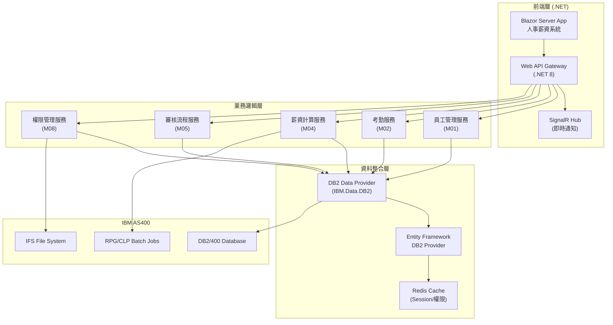
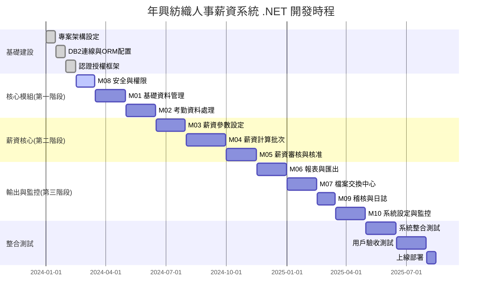
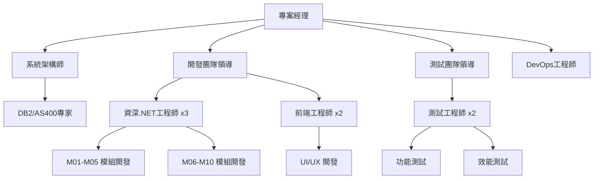

# 年興紡織人事薪資系統 .NET 前端開發規劃

> **版本：** v1.0  
> **日期：** 2025-01-26  
> **作者：** 開發團隊  
> **基於：** 年興紡織_人事薪資系統_規格書_v_2.md

---

## 📋 目錄

1. [專案概述](#專案概述)
2. [整體系統架構](#整體系統架構)
3. [技術堆疊選型](#技術堆疊選型)
4. [十大功能模組設計](#十大功能模組設計)
5. [AS400 DB2 整合方案](#as400-db2-整合方案)
6. [開發時程規劃](#開發時程規劃)
7. [團隊配置建議](#團隊配置建議)
8. [風險控制](#風險控制)
9. [交付清單](#交付清單)
10. [成功標準](#成功標準)

---

## 🎯 專案概述

### 專案目標
基於年興紡織現有人事薪資系統規格書，開發全新的 **.NET 前端應用程式**，保持所有原有功能模組完整性，並確保與 **AS400 DB2** 系統的無縫整合。

### 核心需求
- ✅ **完整功能對應**：實作規格書中的 M01-M10 所有模組
- ✅ **現代化介面**：採用 Blazor Server 技術提供現代化用戶體驗
- ✅ **資料整合**：與 AS400 DB2/400 資料庫完全整合
- ✅ **效能優化**：支援 10k+ 員工的高效能處理
- ✅ **安全合規**：符合 SOX、ISO 27001、個資法等規範

---

## 🏗️ 整體系統架構



### 架構特點

| 層級 | 說明 | 優勢 |
|------|------|------|
| **前端層** | Blazor Server + Web API | 伺服器端渲染，減少客戶端負載 |
| **業務邏輯層** | 領域服務設計 | 業務邏輯集中管理，易於維護 |
| **資料整合層** | EF Core + 原生 DB2 | 既有 ORM 優勢又保持 AS400 相容性 |
| **快取層** | Redis 分散式快取 | 提升系統效能，支援叢集部署 |

---

## 🛠️ 技術堆疊選型

### 核心技術框架

| 層級 | 技術選型 | 版本 | 說明 |
|------|----------|------|------|
| **前端框架** | Blazor Server | .NET 8 | 伺服器端渲染，豐富互動體驗 |
| **API框架** | ASP.NET Core Web API | .NET 8 | RESTful API + OpenAPI 文檔 |
| **即時通訊** | SignalR | .NET 8 | 批次進度、審核通知即時推送 |
| **ORM框架** | Entity Framework Core | 8.0 | 物件關聯對應，支援 DB2 Provider |
| **DB2連接** | IBM.Data.DB2.Core | 最新版 | 原生 DB2 連接驅動程式 |
| **快取系統** | Redis | 7.x | Session 管理、權限快取 |
| **認證授權** | ASP.NET Core Identity | .NET 8 | JWT + Cookie 混合認證 |

### 輔助工具與套件

| 用途 | 工具/套件 | 版本 | 說明 |
|------|-----------|------|------|
| **工作排程** | Hangfire | 1.8+ | 背景任務與排程處理 |
| **檔案處理** | NPOI / ClosedXML | 最新版 | Excel 匯入匯出處理 |
| **PDF產生** | QuestPDF | 最新版 | 高效能薪資單 PDF 產生 |
| **日誌系統** | Serilog + Seq | 最新版 | 結構化日誌記錄與查詢 |
| **監控系統** | Application Insights | 最新版 | 應用程式效能監控 |
| **測試框架** | xUnit + Moq | 最新版 | 單元測試與模擬框架 |
| **API文檔** | Swagger/OpenAPI | .NET 8 | 自動化 API 文檔產生 |

### 開發工具建議

```yaml
IDE: Visual Studio 2022 Enterprise
版控: Git + Azure DevOps / GitHub
CI/CD: Azure DevOps Pipelines
容器: Docker + Kubernetes
監控: Application Insights + Grafana
```

---

## 📦 十大功能模組設計

### M01 - 基礎資料管理模組

#### 🎯 核心功能
- 員工主檔維護 (支援歷史版本追蹤)
- 組織架構樹狀管理
- 職級與薪級設定
- 批次匯入匯出功能
- ElasticSearch 整合搜尋

#### 💻 .NET 實作設計

```csharp
// 核心實體模型
[Table("EMPLOYEE_MASTER")]
public class EmployeeMaster
{
    [Key]
    [Column("EMP_ID")]
    public string EmpId { get; set; }
    
    [Column("ID_NO")]
    [Encrypted] // 自定義加密屬性
    public string IdNo { get; set; }
    
    [Column("BANK_ACC")]
    [Encrypted]
    public string BankAcc { get; set; }
    
    [Column("ORG_ID")]
    public string OrgId { get; set; }
    
    [Column("GRADE_ID")]
    public string GradeId { get; set; }
    
    [Column("EFF_DATE")]
    public DateTime EffectiveDate { get; set; }
    
    [Column("EXP_DATE")]
    public DateTime? ExpiryDate { get; set; }
}

// 服務介面定義
public interface IEmployeeService
{
    Task<EmployeeMaster> CreateEmployeeAsync(CreateEmployeeRequest request);
    Task<EmployeeMaster> UpdateEmployeeAsync(string empId, UpdateEmployeeRequest request);
    Task<SearchResult<EmployeeMaster>> SearchEmployeesAsync(SearchCriteria criteria);
    Task<bool> BulkImportAsync(IFormFile csvFile);
    Task<List<EmployeeMaster>> GetEmployeeHistoryAsync(string empId);
}

// 服務實作範例
public class EmployeeService : IEmployeeService
{
    private readonly IRepository<EmployeeMaster> _employeeRepo;
    private readonly IEncryptionService _encryptionService;
    private readonly ILogger<EmployeeService> _logger;
    
    public async Task<EmployeeMaster> CreateEmployeeAsync(CreateEmployeeRequest request)
    {
        var employee = new EmployeeMaster
        {
            EmpId = await GenerateEmployeeIdAsync(),
            IdNo = await _encryptionService.EncryptAsync(request.IdNo),
            BankAcc = await _encryptionService.EncryptAsync(request.BankAcc),
            OrgId = request.OrgId,
            GradeId = request.GradeId,
            EffectiveDate = DateTime.Now
        };
        
        await _employeeRepo.AddAsync(employee);
        await _employeeRepo.SaveChangesAsync();
        
        _logger.LogInformation("Created employee {EmpId}", employee.EmpId);
        return employee;
    }
}
```

#### 🖥️ 前端元件規劃
- **員工主檔維護頁面** (Blazor Server Page)
- **員工快速搜尋元件** (ElasticSearch 整合)
- **組織架構樹狀元件** (TreeView Component)
- **批次匯入精靈** (Multi-step Wizard Component)

---

### M02 - 考勤資料處理模組

#### 🎯 核心功能
- DAT 檔案匯入與解析
- 考勤異常檢核與處理
- AI 智能補登建議
- 即時考勤儀表板
- 加班時數計算與審核

#### 💻 .NET 實作設計

```csharp
// 考勤交易實體
[Table("ATTEND_TXN")]
public class AttendanceTransaction
{
    [Key]
    [Column("TXN_ID")]
    public string TransactionId { get; set; }
    
    [Column("EMP_ID")]
    public string EmpId { get; set; }
    
    [Column("DATE")]
    public DateTime Date { get; set; }
    
    [Column("IN_TIME")]
    public TimeSpan? InTime { get; set; }
    
    [Column("OUT_TIME")]
    public TimeSpan? OutTime { get; set; }
    
    [Column("OT_HOURS")]
    [Column(TypeName = "DECIMAL(5,2)")]
    public decimal OtHours { get; set; }
    
    [Column("STATUS")]
    public string Status { get; set; } // 'A'pproved, 'P'ending, 'R'ejected
    
    [Column("CREATED_TS")]
    public DateTime CreatedTimestamp { get; set; }
}

// 考勤服務介面
public interface IAttendanceService
{
    Task<ImportResult> ImportAttendanceDataAsync(IFormFile datFile);
    Task<List<AttendanceException>> ValidateAttendanceAsync(string batchId);
    Task<bool> ApproveAttendanceAsync(string empId, DateTime date);
    Task<AiSuggestion> GetAiCompletionSuggestionAsync(string empId, DateTime date);
    Task<AttendanceDashboard> GetDashboardDataAsync(string orgId);
}

// 匯入結果模型
public class ImportResult
{
    public string BatchId { get; set; }
    public int TotalRecords { get; set; }
    public int SuccessCount { get; set; }
    public int ErrorCount { get; set; }
    public List<ImportError> Errors { get; set; }
    public ImportStatus Status { get; set; }
}

// AI 補登建議服務
public class AiAttendanceService
{
    private readonly MLContext _mlContext;
    private readonly ITransformer _model;
    
    public async Task<AiSuggestion> PredictAttendanceAsync(string empId, DateTime date)
    {
        // 載入員工歷史考勤資料
        var historicalData = await GetHistoricalAttendanceAsync(empId);
        
        // 建立預測輸入
        var input = new AttendancePredictionInput
        {
            EmpId = empId,
            Date = date,
            DayOfWeek = (int)date.DayOfWeek,
            // 其他特徵...
        };
        
        // 執行預測
        var prediction = _model.Transform(_mlContext.Data.LoadFromEnumerable(new[] { input }));
        
        return new AiSuggestion
        {
            SuggestedInTime = prediction.GetColumn<TimeSpan>("InTime").First(),
            SuggestedOutTime = prediction.GetColumn<TimeSpan>("OutTime").First(),
            Confidence = prediction.GetColumn<float>("Confidence").First()
        };
    }
}
```

#### 🖥️ 前端元件規劃
- **考勤儀表板** (Dashboard with Real-time Updates via SignalR)
- **DAT檔案上傳介面** (Drag & Drop Upload Component)
- **異常考勤處理頁面** (Exception Handling Workflow)
- **AI補登建議元件** (ML.NET Integration Component)

---

### M03 - 薪資參數設定模組

#### 🎯 核心功能
- 薪資項目主檔維護
- 稅率表管理 (支援 XML 匯入)
- 社保費率設定
- 公式編輯器 (DSL 支援)
- 參數版本控制

#### 💻 .NET 實作設計

```csharp
// 薪資參數實體
[Table("PAY_PARAM_HIST")]
public class PayrollParameter
{
    [Key]
    [Column("PARAM_ID")]
    public string ParamId { get; set; }
    
    [Column("PARAM_TYPE")]
    public string ParamType { get; set; } // TAX, INSURANCE, ALLOWANCE
    
    [Column("VALUE")]
    [Column(TypeName = "DECIMAL(15,4)")]
    public decimal Value { get; set; }
    
    [Column("EFF_DATE")]
    public DateTime EffectiveDate { get; set; }
    
    [Column("EXP_DATE")]
    public DateTime? ExpiryDate { get; set; }
    
    [Column("FORMULA_DSL")]
    public string FormulaDsl { get; set; } // 公式DSL字串
    
    [Column("VERSION")]
    public int Version { get; set; }
}

// 稅率級距實體
[Table("TAX_BRACKET")]
public class TaxBracket
{
    [Key]
    [Column("SEQ_ID")]
    public int SequenceId { get; set; }
    
    [Column("YEAR")]
    public int Year { get; set; }
    
    [Column("MIN_AMT")]
    [Column(TypeName = "DECIMAL(15,2)")]
    public decimal MinAmount { get; set; }
    
    [Column("MAX_AMT")]
    [Column(TypeName = "DECIMAL(15,2)")]
    public decimal MaxAmount { get; set; }
    
    [Column("RATE")]
    [Column(TypeName = "DECIMAL(5,4)")]
    public decimal Rate { get; set; }
    
    [Column("QUICK_DEDUCT")]
    [Column(TypeName = "DECIMAL(15,2)")]
    public decimal QuickDeduct { get; set; }
}

// 薪資參數服務
public interface IPayrollParameterService
{
    Task<bool> UpdateTaxBracketAsync(TaxBracketRequest request);
    Task<bool> ValidateFormulaDslAsync(string formula);
    Task<decimal> SimulatePayrollAsync(SimulationRequest request);
    Task<PayrollParameter> GetActiveParameterAsync(string paramType, DateTime effectiveDate);
    Task<List<TaxBracket>> ImportTaxXmlAsync(IFormFile xmlFile);
}

// DSL 公式解析器
public class FormulaDslParser
{
    public bool ValidateFormula(string formula)
    {
        try
        {
            // 使用 ANTLR 或正規表達式解析 DSL
            var ast = ParseToAst(formula);
            return ValidateAst(ast);
        }
        catch
        {
            return false;
        }
    }
    
    public decimal CalculateFormula(string formula, Dictionary<string, decimal> variables)
    {
        var ast = ParseToAst(formula);
        return EvaluateAst(ast, variables);
    }
}
```

---

### M04 - 薪資計算批次模組

#### 🎯 核心功能
- 高效能批次薪資計算
- Checkpoint 重跑機制
- 並行處理支援
- 即時進度監控
- 差異分析與比較

#### 💻 .NET 實作設計

```csharp
// 薪資批次實體
[Table("PAYROLL_BATCH")]
public class PayrollBatch
{
    [Key]
    [Column("BATCH_ID")]
    public string BatchId { get; set; }
    
    [Column("YEAR_MONTH")]
    public string YearMonth { get; set; }
    
    [Column("STATUS")]
    public BatchStatus Status { get; set; }
    
    [Column("START_TIME")]
    public DateTime StartTime { get; set; }
    
    [Column("END_TIME")]
    public DateTime? EndTime { get; set; }
    
    [Column("TOTAL_EMPLOYEES")]
    public int TotalEmployees { get; set; }
    
    [Column("PROCESSED_COUNT")]
    public int ProcessedCount { get; set; }
    
    [Column("CHECKPOINT_STEP")]
    public int CheckpointStep { get; set; }
}

// 薪資計算服務
public interface IPayrollBatchService
{
    Task<string> StartPayrollBatchAsync(string yearMonth);
    Task<BatchProgress> GetBatchProgressAsync(string batchId);
    Task<bool> RestartFromCheckpointAsync(string batchId, int stepNumber);
    Task<PayrollDifference> CompareWithPreviousBatchAsync(string currentBatchId, string previousBatchId);
}

// 高效能批次處理實作
public class PayrollBatchService : IPayrollBatchService
{
    private readonly IHubContext<PayrollHub> _hubContext;
    private readonly IRepository<PayrollBatch> _batchRepo;
    private readonly IPayrollCalculationEngine _calculationEngine;
    
    public async Task<string> StartPayrollBatchAsync(string yearMonth)
    {
        var batchId = Guid.NewGuid().ToString();
        var batch = new PayrollBatch
        {
            BatchId = batchId,
            YearMonth = yearMonth,
            Status = BatchStatus.Started,
            StartTime = DateTime.Now
        };
        
        await _batchRepo.AddAsync(batch);
        await _batchRepo.SaveChangesAsync();
        
        // 啟動背景工作
        BackgroundJob.Enqueue(() => ProcessPayrollBatchAsync(batchId));
        
        return batchId;
    }
    
    [JobDisplayName("薪資批次計算 - {0}")]
    public async Task ProcessPayrollBatchAsync(string batchId)
    {
        var batch = await _batchRepo.GetByIdAsync(batchId);
        var employees = await GetActiveEmployeesAsync(batch.YearMonth);
        
        batch.TotalEmployees = employees.Count;
        batch.Status = BatchStatus.Processing;
        await _batchRepo.UpdateAsync(batch);
        
        // 並行處理員工薪資
        var processingTasks = employees
            .Chunk(100) // 每批處理100筆
            .Select(async employeeChunk =>
            {
                foreach (var employee in employeeChunk)
                {
                    try
                    {
                        await ProcessEmployeePayrollAsync(batchId, employee);
                        
                        // 更新進度
                        Interlocked.Increment(ref batch.ProcessedCount);
                        
                        // 即時推送進度
                        await _hubContext.Clients.All.SendAsync("BatchProgress", new
                        {
                            BatchId = batchId,
                            Progress = (double)batch.ProcessedCount / batch.TotalEmployees * 100
                        });
                        
                        // Checkpoint 機制
                        if (batch.ProcessedCount % 500 == 0)
                        {
                            await CreateCheckpointAsync(batchId);
                        }
                    }
                    catch (Exception ex)
                    {
                        await LogPayrollErrorAsync(batchId, employee.EmpId, ex);
                    }
                }
            });
        
        await Task.WhenAll(processingTasks);
        
        batch.Status = BatchStatus.Completed;
        batch.EndTime = DateTime.Now;
        await _batchRepo.UpdateAsync(batch);
        
        // 通知完成
        await _hubContext.Clients.All.SendAsync("BatchCompleted", batchId);
    }
}

// 薪資計算引擎
public class PayrollCalculationEngine
{
    public async Task<PayrollSummary> CalculateEmployeePayrollAsync(
        EmployeeMaster employee, 
        AttendanceSummary attendance, 
        List<PayrollParameter> parameters)
    {
        // 計算應發薪資
        var grossPay = await CalculateGrossPayAsync(employee, attendance, parameters);
        
        // 計算扣款
        var deductions = await CalculateDeductionsAsync(employee, grossPay, parameters);
        
        // 計算實發薪資
        var netPay = grossPay - deductions.TotalDeductions;
        
        return new PayrollSummary
        {
            EmpId = employee.EmpId,
            GrossPay = grossPay,
            Deductions = deductions,
            NetPay = netPay,
            CalculatedDate = DateTime.Now
        };
    }
}
```

#### 🖥️ 前端元件規劃
- **批次啟動控制台** (Batch Control Panel)
- **即時進度監控** (Real-time Progress Dashboard with SignalR)
- **重跑機制介面** (Restart Management Interface)
- **差異分析圖表** (Variance Analysis Charts with Chart.js)

---

### M05 - 薪資審核與核准模組

#### 🎯 核心功能
- 多階段審核工作流程
- 部門主管審核介面
- 財務核准與銀行匯款
- 審核意見與退回機制
- 電子簽核支援

#### 💻 .NET 實作設計

```csharp
// 薪資審核實體
[Table("PAYROLL_APPROVAL_HDR")]
public class PayrollApproval
{
    [Key]
    [Column("APPROVAL_ID")]
    public string ApprovalId { get; set; }
    
    [Column("BATCH_ID")]
    public string BatchId { get; set; }
    
    [Column("STATUS")]
    public ApprovalStatus Status { get; set; }
    
    [Column("CURRENT_STAGE")]
    public string CurrentStage { get; set; } // DEPT_REVIEW, HR_REVIEW, FIN_APPROVAL
    
    [Column("CREATED_DATE")]
    public DateTime CreatedDate { get; set; }
    
    [Column("APPROVED_DATE")]
    public DateTime? ApprovedDate { get; set; }
    
    // 導航屬性
    public virtual List<ApprovalStep> ApprovalSteps { get; set; }
}

// 審核步驟實體
[Table("PAYROLL_APPROVAL_DTL")]
public class ApprovalStep
{
    [Key]
    [Column("STEP_ID")]
    public string StepId { get; set; }
    
    [Column("APPROVAL_ID")]
    public string ApprovalId { get; set; }
    
    [Column("STEP_ORDER")]
    public int StepOrder { get; set; }
    
    [Column("APPROVER_ID")]
    public string ApproverId { get; set; }
    
    [Column("APPROVAL_STATUS")]
    public StepStatus ApprovalStatus { get; set; }
    
    [Column("COMMENTS")]
    public string Comments { get; set; }
    
    [Column("APPROVED_DATE")]
    public DateTime? ApprovedDate { get; set; }
}

// 審核服務介面
public interface IPayrollApprovalService
{
    Task<bool> SubmitDeptApprovalAsync(DeptApprovalRequest request);
    Task<bool> RejectPayrollAsync(string batchId, string reason);
    Task<ApprovalWorkflow> GetApprovalWorkflowAsync(string batchId);
    Task<List<PayrollApproval>> GetPendingApprovalsAsync(string userId);
    Task<bool> GenerateBankFileAsync(string batchId);
}

// 工作流程引擎
public class ApprovalWorkflowEngine
{
    private readonly IRepository<PayrollApproval> _approvalRepo;
    private readonly INotificationService _notificationService;
    
    public async Task<bool> ProcessApprovalAsync(string approvalId, string userId, ApprovalAction action, string comments)
    {
        var approval = await _approvalRepo.GetByIdAsync(approvalId);
        var currentStep = approval.ApprovalSteps.FirstOrDefault(s => s.ApprovalStatus == StepStatus.Pending);
        
        if (currentStep == null || currentStep.ApproverId != userId)
        {
            throw new UnauthorizedAccessException("無權限執行此審核操作");
        }
        
        currentStep.ApprovalStatus = action == ApprovalAction.Approve ? StepStatus.Approved : StepStatus.Rejected;
        currentStep.Comments = comments;
        currentStep.ApprovedDate = DateTime.Now;
        
        if (action == ApprovalAction.Approve)
        {
            // 移到下一個審核階段
            var nextStep = approval.ApprovalSteps
                .Where(s => s.StepOrder > currentStep.StepOrder)
                .OrderBy(s => s.StepOrder)
                .FirstOrDefault();
            
            if (nextStep != null)
            {
                // 通知下一個審核者
                await _notificationService.NotifyApproverAsync(nextStep.ApproverId, approval);
            }
            else
            {
                // 全部審核完成
                approval.Status = ApprovalStatus.Approved;
                approval.ApprovedDate = DateTime.Now;
                await TriggerBankFileGenerationAsync(approval.BatchId);
            }
        }
        else
        {
            // 退回重新處理
            approval.Status = ApprovalStatus.Rejected;
            await _notificationService.NotifyRejectionAsync(approval);
        }
        
        await _approvalRepo.UpdateAsync(approval);
        return true;
    }
}
```

#### 🖥️ 前端元件規劃
- **審核工作台** (Approval Workbench Dashboard)
- **工作流程追蹤器** (Workflow Progress Tracker)
- **審核意見系統** (Comment and Feedback System)
- **通知中心** (Real-time Notification Center)

---

### M06-M10 模組簡要說明

#### M06 - 報表與匯出模組
- **核心功能：** PDF薪資單產生、銀行匯款檔、政府申報檔案、ERP GL分錄
- **技術實作：** QuestPDF、ClosedXML、XML序列化、SFTP整合

#### M07 - 檔案交換中心模組  
- **核心功能：** SFTP/FTP傳輸、PGP加密、檔案完整性驗證、自動重傳
- **技術實作：** SSH.NET、GnuPG.NET、Hangfire排程、檔案監控

#### M08 - 安全與權限模組
- **核心功能：** JWT認證、Role-Based權限、Field-Level加密、稽核日誌
- **技術實作：** ASP.NET Core Identity、AES加密、LDAP整合

#### M09 - 稽核與日誌模組
- **核心功能：** 操作稽核、批次稽核、合規報表、異常偵測
- **技術實作：** Serilog、ElasticSearch、結構化日誌、GDPR合規

#### M10 - 系統設定與監控模組
- **核心功能：** 排程管理、監控儀表板、告警通知、系統設定
- **技術實作：** Hangfire、Application Insights、SignalR、配置管理

---

## 🔗 AS400 DB2 整合方案

### 資料存取策略

#### 1. 連線配置

```json
{
  "ConnectionStrings": {
    "DB2Connection": "Server=AS400_IP;Database=HRPAYDB;UserID=PAYUSER;Password=xxx;Pooling=true;Max Pool Size=100;Command Timeout=300"
  },
  "DB2Settings": {
    "CommandTimeout": 300,
    "EnablePooling": true,
    "MaxPoolSize": 100,
    "MinPoolSize": 10,
    "ConnectionLifetime": 300
  }
}
```

#### 2. Entity Framework DB2 配置

```csharp
// DB2 DbContext 配置
public class HRPayrollDbContext : DbContext
{
    public HRPayrollDbContext(DbContextOptions<HRPayrollDbContext> options) : base(options) { }
    
    public DbSet<EmployeeMaster> EmployeeMasters { get; set; }
    public DbSet<AttendanceTransaction> AttendanceTransactions { get; set; }
    public DbSet<PayrollBatch> PayrollBatches { get; set; }
    
    protected override void OnModelCreating(ModelBuilder modelBuilder)
    {
        // DB2 特定配置
        modelBuilder.Entity<EmployeeMaster>(entity =>
        {
            entity.HasKey(e => e.EmpId);
            entity.Property(e => e.EmpId).HasColumnType("CHAR(6)").IsRequired();
            entity.Property(e => e.IdNo).HasColumnType("CHAR(10)");
            entity.Property(e => e.BankAcc).HasColumnType("CHAR(20)");
            entity.ToTable("EMPLOYEE_MASTER", "PAYLIB");
        });
        
        // 設定 DB2 分割表
        modelBuilder.Entity<AttendanceTransaction>(entity =>
        {
            entity.Property(e => e.Date).HasColumnType("DATE");
            entity.Property(e => e.InTime).HasColumnType("TIME");
            entity.Property(e => e.OutTime).HasColumnType("TIME");
            entity.HasIndex(e => new { e.EmpId, e.Date }).HasDatabaseName("IX_EMP_DATE");
        });
    }
    
    protected override void OnConfiguring(DbContextOptionsBuilder optionsBuilder)
    {
        if (!optionsBuilder.IsConfigured)
        {
            optionsBuilder.UseDB2(connectionString, options =>
            {
                options.SetServerInfo(IBMDBServerType.DB2_LUW);
                options.CommandTimeout(300);
            });
        }
    }
}

// Startup.cs 中的服務註冊
public void ConfigureServices(IServiceCollection services)
{
    services.AddDbContext<HRPayrollDbContext>(options =>
        options.UseDB2(Configuration.GetConnectionString("DB2Connection"))
    );
    
    services.AddScoped(typeof(IRepository<>), typeof(DB2Repository<>));
}
```

#### 3. 原生 DB2 存取層

```csharp
// DB2 原生存取服務
public class DB2NativeService
{
    private readonly string _connectionString;
    
    public async Task<DataTable> ExecuteStoredProcedureAsync(string procedureName, params DB2Parameter[] parameters)
    {
        using var connection = new DB2Connection(_connectionString);
        using var command = new DB2Command(procedureName, connection)
        {
            CommandType = CommandType.StoredProcedure,
            CommandTimeout = 300
        };
        
        command.Parameters.AddRange(parameters);
        
        await connection.OpenAsync();
        using var adapter = new DB2DataAdapter(command);
        var dataTable = new DataTable();
        adapter.Fill(dataTable);
        
        return dataTable;
    }
    
    public async Task<bool> CallRpgProgramAsync(string library, string program, params string[] parameters)
    {
        try
        {
            // 透過 XMLSERVICE 呼叫 RPG 程式
            var xmlRequest = BuildXmlServiceRequest(library, program, parameters);
            var result = await ExecuteXmlServiceAsync(xmlRequest);
            return ParseXmlServiceResponse(result);
        }
        catch (Exception ex)
        {
            _logger.LogError(ex, "呼叫 RPG 程式失敗: {Library}/{Program}", library, program);
            return false;
        }
    }
}

// RPG 程式整合服務
public interface IRpgIntegrationService
{
    Task<JobResult> SubmitPayrollBatchAsync(string yearMonth);
    Task<JobStatus> GetJobStatusAsync(string jobId);
    Task<bool> TriggerDataImportAsync(string filename);
}

public class RpgIntegrationService : IRpgIntegrationService
{
    public async Task<JobResult> SubmitPayrollBatchAsync(string yearMonth)
    {
        var parameters = new[]
        {
            new DB2Parameter("@YYMM", yearMonth),
            new DB2Parameter("@JOB_ID", SqlDbType.VarChar, 20) { Direction = ParameterDirection.Output }
        };
        
        await _db2Service.ExecuteStoredProcedureAsync("PAYLIB.SUBMIT_PAYROLL", parameters);
        
        return new JobResult
        {
            JobId = parameters[1].Value.ToString(),
            Status = JobStatus.Submitted,
            SubmittedAt = DateTime.Now
        };
    }
}
```

#### 4. 資料同步策略

```csharp
// 資料同步服務
public class DataSynchronizationService
{
    public async Task SyncEmployeeDataAsync()
    {
        // 從 AS400 同步員工主檔異動
        var lastSyncTime = await GetLastSyncTimeAsync("EMPLOYEE_MASTER");
        var changedEmployees = await GetChangedEmployeesAsync(lastSyncTime);
        
        foreach (var employee in changedEmployees)
        {
            await ProcessEmployeeChangeAsync(employee);
        }
        
        await UpdateLastSyncTimeAsync("EMPLOYEE_MASTER", DateTime.Now);
    }
    
    private async Task ProcessEmployeeChangeAsync(EmployeeMaster employee)
    {
        // 檢查是否需要加密敏感欄位
        if (!string.IsNullOrEmpty(employee.IdNo))
        {
            employee.IdNo = await _encryptionService.EncryptAsync(employee.IdNo);
        }
        
        if (!string.IsNullOrEmpty(employee.BankAcc))
        {
            employee.BankAcc = await _encryptionService.EncryptAsync(employee.BankAcc);
        }
        
        // 更新或新增至 .NET 端快取
        await _employeeRepo.UpsertAsync(employee);
    }
}
```

---

## 📅 開發時程規劃

### 整體時程概覽



### 詳細階段規劃

#### **🏗️ 第一階段：基礎建設 (1-2月)**

**目標：** 建立穩固的系統基礎架構

| 週次 | 工作項目 | 交付物 | 負責人員 |
|------|----------|--------|----------|
| W1-2 | 專案初始化與架構設計 | 解決方案架構、專案範本 | 架構師 + PM |
| W3-4 | DB2 連線與 ORM 配置 | DB2 Provider、Entity 設計 | DB2專家 + 後端工程師 |
| W5-6 | 認證授權框架開發 | JWT + Identity 框架 | 資深.NET工程師 |
| W7-8 | 基礎 UI 元件庫 | Blazor 元件庫、樣式系統 | 前端工程師 |

**關鍵交付物：**
- ✅ .NET 8 解決方案架構
- ✅ DB2 連線與 Entity Framework 配置
- ✅ JWT + Cookie 認證授權系統
- ✅ Blazor Server 基礎元件庫
- ✅ CI/CD Pipeline 基礎設定

#### **⚙️ 第二階段：核心模組開發 (3-6月)**

##### **M08 安全與權限 (2/16-3/15)**

| 週次 | 開發重點 | 驗收標準 |
|------|----------|----------|
| W1 | JWT Token 管理、Session 服務 | Token 簽發與驗證正常 |
| W2 | Role-Based 權限控制 | 權限矩陣設定與驗證 |
| W3 | Row-Level Security 實作 | 部門資料隔離測試通過 |
| W4 | Field-Level 加密、MFA 整合 | 敏感欄位加密、MFA 登入 |

##### **M01 基礎資料管理 (3/16-4/30)**

| 週次 | 開發重點 | 驗收標準 |
|------|----------|----------|
| W1-2 | 員工主檔 CRUD、歷史版本 | 員工資料維護功能完整 |
| W3-4 | 組織架構、職級管理 | 樹狀結構展示與編輯 |
| W5-6 | 批次匯入匯出、搜尋整合 | 大量資料處理與快速搜尋 |

##### **M02 考勤資料處理 (5/1-6/15)**

| 週次 | 開發重點 | 驗收標準 |
|------|----------|----------|
| W1-2 | DAT 檔案解析、匯入流程 | 考勤資料正確匯入 |
| W3-4 | 異常檢核、AI 補登 | 異常偵測與智能建議 |
| W5-6 | 即時儀表板、OT 計算 | 即時監控與加班計算 |

#### **💰 第三階段：薪資核心 (6-11月)**

##### **M03 薪資參數設定 (6/16-7/30)**
- 稅率表維護與 XML 匯入
- 公式編輯器 (DSL 支援)
- 參數版本控制機制

##### **M04 薪資計算批次 (8/1-9/30)**
- 高效能批次計算引擎
- Checkpoint 重跑機制
- 並行處理與進度監控

##### **M05 薪資審核與核准 (10/1-11/15)**
- 工作流程引擎
- 多階段審核介面
- 電子簽核整合

#### **📊 第四階段：輸出與監控 (11月-4月)**

- M06: PDF 報表、銀行匯款檔
- M07: SFTP 檔案傳輸、加密機制
- M09: 稽核軌跡、合規報表
- M10: 系統監控、告警機制

#### **🧪 第五階段：測試與上線 (5-8月)**

| 階段 | 期間 | 重點工作 | 驗收標準 |
|------|------|----------|----------|
| **系統整合測試** | 5/1-6/15 | 端到端流程測試、效能測試 | 所有功能正常運作 |
| **用戶驗收測試** | 6/16-7/31 | 使用者測試、培訓 | UAT 簽核通過 |
| **上線部署** | 8/1-8/15 | 生產環境部署、資料遷移 | 系統穩定運行 |

---

## 👥 團隊配置建議

### 核心團隊組成

| 角色 | 人數 | 主要職責 | 技能要求 |
|------|------|----------|----------|
| **專案經理** | 1 | 專案規劃、進度控制、風險管理 | PMP、敏捷開發經驗 |
| **系統架構師** | 1 | 技術架構設計、技術決策 | .NET 架構、DB2 整合經驗 |
| **資深.NET工程師** | 3 | 核心業務邏輯開發 | .NET 8、Entity Framework、Blazor |
| **前端工程師** | 2 | Blazor UI/UX 開發 | Blazor Server、CSS、JavaScript |
| **DB2/AS400專家** | 1 | 資料庫整合、RPG 對接 | DB2/400、RPG、XMLSERVICE |
| **測試工程師** | 2 | 自動化測試、品質控制 | xUnit、Selenium、效能測試 |
| **DevOps工程師** | 1 | CI/CD、部署自動化、監控 | Azure DevOps、Docker、Kubernetes |

### 專案組織架構



### 技能發展計畫

#### **培訓需求分析**

| 技術領域 | 目標人員 | 培訓內容 | 預期成果 |
|----------|----------|----------|----------|
| **.NET 8 新特性** | 全體.NET工程師 | .NET 8 功能、效能最佳化 | 熟練運用新框架 |
| **Blazor Server** | 前端工程師 | 元件開發、狀態管理、SignalR | 獨立開發複雜UI |
| **DB2 整合** | 後端工程師 | IBM Data Provider、效能調校 | 高效資料存取 |
| **AS400 系統** | DB2專家 | RPG、XMLSERVICE、檔案系統 | 深度系統整合 |

---

## ⚠️ 風險控制

### 技術風險與對策

| 風險項目 | 風險等級 | 影響 | 對策 |
|----------|----------|------|------|
| **DB2 連線穩定性** | 🔴 高 | 系統無法存取資料 | 連線池設定、容錯機制、監控告警 |
| **RPG 程式整合** | 🟡 中 | 批次功能異常 | XMLSERVICE 封裝、錯誤處理、回滾機制 |
| **大量資料處理** | 🟡 中 | 效能瓶頸 | 分批處理、非同步機制、快取策略 |
| **即時性需求** | 🟡 中 | 用戶體驗差 | SignalR + Redis、CDN 加速 |
| **第三方套件相依** | 🟢 低 | 升級困難 | 版本控制、相容性測試 |

### 業務風險與對策

| 風險項目 | 風險等級 | 影響 | 對策 |
|----------|----------|------|------|
| **資料遷移風險** | 🔴 高 | 資料遺失或錯誤 | 完整備份、段階遷移、驗證機制 |
| **使用者接受度** | 🟡 中 | 系統使用率低 | 提前溝通、培訓計畫、漸進式上線 |
| **法規合規** | 🔴 高 | 法律風險 | 法務審查、安全稽核、合規檢查 |
| **專案時程延遲** | 🟡 中 | 上線時間推遲 | 里程碑管控、風險預警、應變計畫 |

### 風險監控機制

#### **技術風險監控**
```csharp
// 健康檢查服務
public class HealthCheckService
{
    public async Task<HealthStatus> CheckDB2ConnectionAsync()
    {
        try
        {
            using var connection = new DB2Connection(_connectionString);
            await connection.OpenAsync();
            return HealthStatus.Healthy;
        }
        catch (Exception ex)
        {
            return HealthStatus.Unhealthy;
        }
    }
    
    public async Task<PerformanceMetrics> GetPerformanceMetricsAsync()
    {
        return new PerformanceMetrics
        {
            ResponseTime = await MeasureResponseTimeAsync(),
            MemoryUsage = GC.GetTotalMemory(false),
            ActiveConnections = GetActiveConnectionCount()
        };
    }
}
```

#### **業務風險監控**
- 每日資料同步狀態檢查
- 使用者登入與操作統計
- 系統錯誤率與回應時間監控
- 定期安全掃描與稽核

---

## 📋 交付清單

### 程式碼交付物

#### **核心應用程式**
- [ ] **HRPayroll.Web** - Blazor Server 主應用程式
- [ ] **HRPayroll.API** - Web API 服務層
- [ ] **HRPayroll.Core** - 業務邏輯核心
- [ ] **HRPayroll.Infrastructure** - 資料存取層
- [ ] **HRPayroll.Shared** - 共用模型與介面
- [ ] **HRPayroll.Tests** - 單元測試與整合測試

#### **專案結構**
```
HRPayroll.Solution/
├── src/
│   ├── HRPayroll.Web/                 # Blazor Server 主專案
│   │   ├── Components/               # Blazor 元件
│   │   ├── Pages/                    # 頁面
│   │   ├── Services/                 # 前端服務
│   │   └── wwwroot/                  # 靜態資源
│   ├── HRPayroll.API/                # Web API 專案
│   │   ├── Controllers/              # API 控制器
│   │   ├── Middleware/               # 中介軟體
│   │   └── Hubs/                     # SignalR Hub
│   ├── HRPayroll.Core/               # 業務邏輯層
│   │   ├── Entities/                 # 實體模型
│   │   ├── Services/                 # 業務服務
│   │   ├── Interfaces/               # 服務介面
│   │   └── Models/                   # DTO 模型
│   ├── HRPayroll.Infrastructure/     # 基礎設施層
│   │   ├── Data/                     # DbContext
│   │   ├── Repositories/             # 資料存取
│   │   ├── Services/                 # 外部服務
│   │   └── Configurations/           # 設定檔
│   └── HRPayroll.Shared/             # 共用專案
│       ├── Constants/                # 常數定義
│       ├── Enums/                    # 列舉
│       └── Extensions/               # 擴充方法
├── tests/
│   ├── HRPayroll.UnitTests/          # 單元測試
│   ├── HRPayroll.IntegrationTests/   # 整合測試
│   └── HRPayroll.LoadTests/          # 負載測試
├── docs/                             # 專案文檔
├── scripts/                          # 部署腳本
└── docker/                           # Docker 設定
```

#### **測試覆蓋率要求**
- [ ] 單元測試覆蓋率 ≥ 80%
- [ ] 整合測試覆蓋主要業務流程
- [ ] 負載測試報告 (10k 員工場景)
- [ ] 安全測試報告 (OWASP 檢查)

### 部署交付物

#### **容器化配置**
- [ ] **Dockerfile** - 應用程式容器化
- [ ] **docker-compose.yml** - 本地開發環境
- [ ] **kubernetes.yaml** - 生產環境部署
- [ ] **nginx.conf** - 反向代理設定

#### **CI/CD 配置**
- [ ] **Azure Pipelines YAML** - 自動化建置部署
- [ ] **GitHub Actions** - 程式碼品質檢查
- [ ] **SonarQube 設定** - 程式碼分析
- [ ] **部署腳本** - 環境設定與資料遷移

#### **監控與日誌**
- [ ] **Application Insights** - 應用程式監控
- [ ] **Serilog 設定** - 結構化日誌
- [ ] **Grafana Dashboard** - 系統監控儀表板
- [ ] **健康檢查端點** - 系統狀態監控

### 文檔交付物

#### **技術文檔**
- [ ] **系統架構設計文檔** - 完整技術架構說明
- [ ] **API 參考文檔** - OpenAPI/Swagger 規格
- [ ] **資料庫設計文檔** - ER 圖與資料字典
- [ ] **部署指南** - 環境設定與部署步驟
- [ ] **開發者指南** - 程式碼規範與最佳實踐

#### **操作文檔**
- [ ] **系統操作手冊** - 管理者操作指南
- [ ] **用戶操作手冊** - 終端用戶使用指南
- [ ] **故障排除指南** - 常見問題與解決方案
- [ ] **維護指南** - 系統維護與更新程序

#### **培訓教材**
- [ ] **用戶培訓簡報** - PowerPoint 培訓材料
- [ ] **操作示範影片** - 功能操作錄影
- [ ] **FAQ 文檔** - 常見問題集
- [ ] **版本更新說明** - 新功能與變更說明

---

## 🎯 成功標準

### 效能指標

| 指標項目 | 目標值 | 測量方法 | 驗收標準 |
|----------|--------|----------|----------|
| **頁面載入時間** | ≤ 2 秒 | Chrome DevTools | 90% 頁面符合標準 |
| **API 回應時間** | ≤ 300ms | Application Insights | 95% API 符合標準 |
| **批次處理效能** | 10k員工 ≤ 30分鐘 | 實際測試 | 生產環境驗證通過 |
| **並發用戶數** | 支援 200 並發用戶 | 負載測試 | 系統穩定運行 |
| **資料庫查詢** | ≤ 100ms (單表查詢) | SQL Profiler | 關鍵查詢最佳化 |

### 可用性指標

| 指標項目 | 目標值 | 測量方法 | 驗收標準 |
|----------|--------|----------|----------|
| **系統可用性** | ≥ 99.5% | 監控系統 | 月度統計達標 |
| **資料正確性** | 100% | 資料驗證 | 零資料遺失 |
| **AS400 整合** | 100% 相容 | 功能測試 | 所有介面正常 |
| **錯誤復原** | ≤ 5 分鐘 | 災難演練 | 自動復原機制 |

### 安全性指標

| 指標項目 | 目標值 | 測量方法 | 驗收標準 |
|----------|--------|----------|----------|
| **資安滲透測試** | 無高風險漏洞 | 第三方評估 | 安全評估報告 |
| **個資法合規** | 100% 合規 | 法務審核 | 合規證明文件 |
| **稽核軌跡** | 完整記錄 | 稽核測試 | 所有操作可追蹤 |
| **加密機制** | AES-256 | 程式碼審查 | 敏感資料加密 |

### 用戶體驗指標

| 指標項目 | 目標值 | 測量方法 | 驗收標準 |
|----------|--------|----------|----------|
| **用戶滿意度** | ≥ 85% | 用戶調查 | UAT 問卷統計 |
| **學習曲線** | ≤ 2 小時 | 培訓觀察 | 新用戶快速上手 |
| **操作錯誤率** | ≤ 5% | 使用統計 | 錯誤操作統計 |
| **界面易用性** | A 級評價 | 可用性測試 | UX 專家評估 |

---

## 💡 後續優化建議

### 短期優化 (6個月內)

#### **效能優化**
- 實作 Redis 分散式快取策略
- 資料庫查詢最佳化與索引調整
- CDN 整合加速靜態資源載入
- 批次處理並行度調校

#### **功能增強**
- 手機版 Responsive Design 優化
- 報表匯出效能提升 (大量資料)
- 即時通知系統強化
- 多語系支援擴充

### 中期發展 (1年內)

#### **架構升級**
- 微服務架構評估與實作
- 容器化部署 (Docker + Kubernetes)
- Cloud Native 轉型規劃
- API Gateway 統一管理

#### **智能化功能**
- AI/ML 異常偵測強化
- 智能薪資建議系統
- 預測性維護機制
- 自動化測試擴充

### 長期規劃 (2-3年)

#### **雲端化轉型**
- Azure/AWS 雲端遷移評估
- Serverless 架構導入
- 全球化部署支援
- 災難復原能力強化

#### **數位轉型**
- 行動 App 開發 (員工自助服務)
- IoT 整合 (智能打卡設備)
- 區塊鏈技術評估 (薪資透明化)
- 大資料分析平台整合

### 技術債務管理

#### **程式碼品質**
- 定期重構計畫
- 程式碼覆蓋率提升至 90%
- 效能基準測試制度化
- 安全漏洞定期掃描

#### **文檔維護**
- API 文檔自動化更新
- 架構文檔版本控制
- 知識庫建立與維護
- 最佳實踐分享機制

---

## 📞 結論與建議

### 專案總結

基於年興紡織人事薪資系統規格書的深度分析，本開發規劃提供了一個完整、可行的 **.NET 8 前端現代化解決方案**。整個規劃涵蓋：

✅ **完整功能對應** - 保持原系統 M01-M10 所有模組功能  
✅ **現代化技術** - 採用最新 .NET 8 + Blazor Server 技術棧  
✅ **seamless 整合** - 與 AS400 DB2 系統無縫對接  
✅ **可擴展架構** - 支援未來微服務化與雲端化發展  
✅ **完整規劃** - 從技術選型到上線部署的全面規劃  

### 關鍵成功因素

1. **技術風險控制** - DB2 整合穩定性是專案成功關鍵
2. **團隊技能整合** - .NET 與 AS400 專業技能並重
3. **分階段交付** - 降低風險並確保持續價值交付
4. **用戶參與** - 早期用戶參與與回饋機制
5. **品質保證** - 完整的測試策略與品質控制

### 立即行動建議

#### **第一週行動項目**
- [ ] 組建專案團隊並進行技能評估
- [ ] 設定開發環境與 DB2 連線測試
- [ ] 建立專案管理工具與協作流程
- [ ] 進行 AS400 系統現況調研

#### **第一個月目標**
- [ ] 完成技術 POC (Proof of Concept)
- [ ] 確認 DB2 整合可行性
- [ ] 建立基礎 CI/CD Pipeline
- [ ] 制定詳細專案執行計畫

### 預算與資源評估

**預估開發成本：** 
- 人力成本：約 NT$ 8,000,000 (10人*18個月)
- 軟體授權：約 NT$ 500,000 
- 硬體設備：約 NT$ 300,000
- **總預算：約 NT$ 8,800,000**

**投資報酬分析：**
- 提升作業效率 30%
- 減少人工錯誤 50%
- 降低維護成本 40%
- 預期 2 年內回收投資

---

## 📎 附錄

### A. 技術參考資源

- [.NET 8 官方文檔](https://docs.microsoft.com/dotnet/)
- [Blazor Server 開發指南](https://docs.microsoft.com/aspnet/core/blazor/)
- [IBM DB2 .NET Provider](https://www.ibm.com/support/pages/db2-net-data-provider)
- [Entity Framework Core 文檔](https://docs.microsoft.com/ef/core/)

### B. 專案範本與工具

- Visual Studio 2022 Enterprise
- Azure DevOps Services
- SonarQube Community Edition
- Postman API Testing

### C. 相關法規與標準

- 個人資料保護法
- 勞動基準法
- ISO 27001 資訊安全標準
- SOX 404 內控制度

---

**📅 最後更新：** 2025-01-26  
**📧 聯絡資訊：** 如需進一步討論或技術諮詢，請隨時聯繫開發團隊。