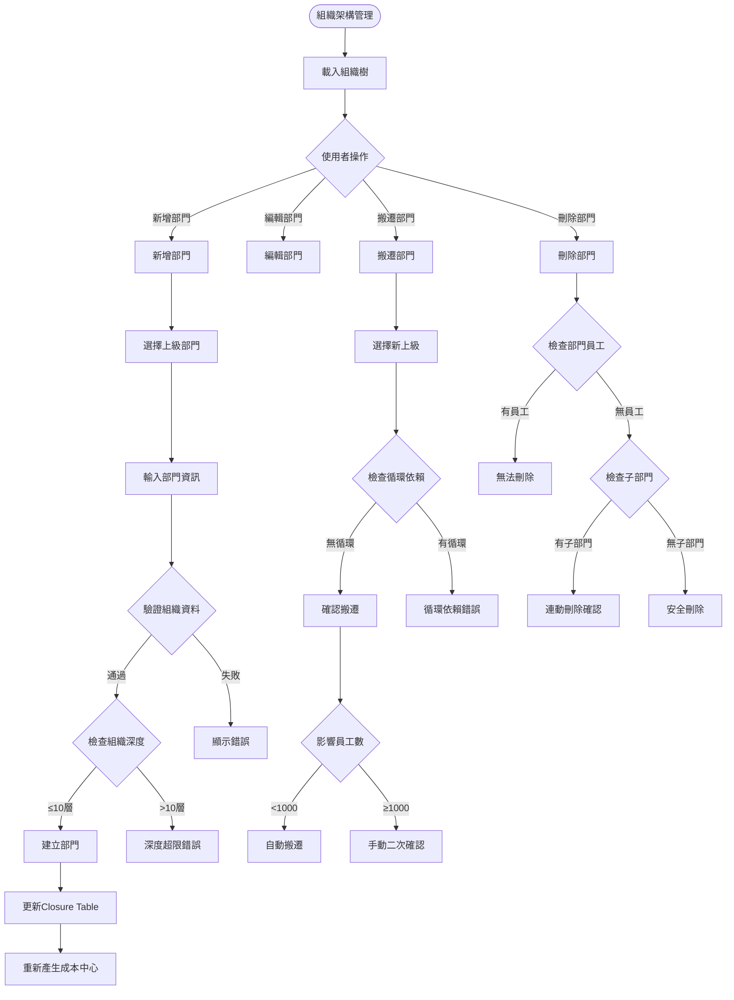

# 年興紡織人事薪資系統 .NET 前端開發計劃書

> **版本：** v2.0  
> **日期：** 2025-01-26  
> **作者：** 開發團隊  
> **基於：** 年興紡織_人事薪資系統_規格書_v_2.md

---

## 📋 目錄

1. [專案概述](#專案概述)
2. [整體系統架構與流程](#整體系統架構與流程)
3. [技術堆疊選型](#技術堆疊選型)
4. [十大功能模組流程設計](#十大功能模組流程設計)
5. [AS400 DB2 整合架構](#as400-db2-整合架構)
6. [系統資料流程](#系統資料流程)
7. [用戶操作流程](#用戶操作流程)
8. [所需材料與資源清單](#所需材料與資源清單)
9. [風險控制](#風險控制)
10. [成功標準](#成功標準)

---

## 🎯 專案概述

### 專案目標
基於年興紡織現有人事薪資系統規格書，開發全新的 **.NET 前端應用程式**，保持所有原有功能模組完整性，並確保與 **AS400 DB2** 系統的無縫整合。

### 核心需求
- ✅ **完整功能對應**：實作規格書中的 M01-M10 所有模組
- ✅ **現代化介面**：採用 Blazor Server 技術提供現代化用戶體驗
- ✅ **資料整合**：與 AS400 DB2/400 資料庫完全整合
- ✅ **效能優化**：支援 10k+ 員工的高效能處理
- ✅ **安全合規**：符合 SOX、ISO 27001、個資法等規範

---

## 🏗️ 整體系統架構與流程

### 系統整體架構圖


### 系統總體業務流程圖


### 資料流向架構圖


---

## 🛠️ 技術堆疊選型

### 核心技術框架

| 層級 | 技術選型 | 版本 | 說明 |
|------|----------|------|------|
| **前端框架** | Blazor Server | .NET 8 | 伺服器端渲染，豐富互動體驗 |
| **API框架** | ASP.NET Core Web API | .NET 8 | RESTful API + OpenAPI 文檔 |
| **即時通訊** | SignalR | .NET 8 | 批次進度、審核通知即時推送 |
| **ORM框架** | Entity Framework Core | 8.0 | 物件關聯對應，支援 DB2 Provider |
| **DB2連接** | IBM.Data.DB2.Core | 最新版 | 原生 DB2 連接驅動程式 |
| **快取系統** | Redis | 7.x | Session 管理、權限快取 |
| **認證授權** | ASP.NET Core Identity | .NET 8 | JWT + Cookie 混合認證 |

### 輔助工具與套件

| 用途 | 工具/套件 | 版本 | 說明 |
|------|-----------|------|------|
| **工作排程** | Hangfire | 1.8+ | 背景任務與排程處理 |
| **檔案處理** | NPOI / ClosedXML | 最新版 | Excel 匯入匯出處理 |
| **PDF產生** | QuestPDF | 最新版 | 高效能薪資單 PDF 產生 |
| **日誌系統** | Serilog + Seq | 最新版 | 結構化日誌記錄與查詢 |
| **監控系統** | Application Insights | 最新版 | 應用程式效能監控 |
| **測試框架** | xUnit + Moq | 最新版 | 單元測試與模擬框架 |
| **API文檔** | Swagger/OpenAPI | .NET 8 | 自動化 API 文檔產生 |

### 開發工具建議

```yaml
IDE: Visual Studio 2022 Enterprise
版控: Git + Azure DevOps / GitHub
CI/CD: Azure DevOps Pipelines
容器: Docker + Kubernetes
監控: Application Insights + Grafana
```

---

## 📦 十大功能模組流程設計

### M01 - 基礎資料管理模組

#### 🎯 核心功能
- 員工主檔維護 (支援歷史版本追蹤)
- 組織架構樹狀管理
- 職級與薪級設定
- 批次匯入匯出功能
- 智能搜尋整合

#### 📊 模組業務流程圖


#### 📋 員工維護詳細流程


#### 🏗️ 組織架構管理流程



#### 📥 批次匯入作業流程


#### 📊 資料流與整合點

| 資料表 | 主要欄位 | 整合關係 | 備註 |
|--------|----------|----------|------|
| **EMPLOYEE_MASTER** | EMP_ID, ID_NO, BANK_ACC | → M02考勤模組<br/>→ M04薪資計算 | 員工主檔，支援Temporal版本 |
| **ORG_UNIT** | ORG_ID, PARENT_ID, COST_CENTER | → M05審核流程<br/>→ M08權限控制 | 組織架構，Closure Table設計 |
| **GRADE_BAND** | GRADE_ID, MIN_PAY, MAX_PAY | → M03薪資參數<br/>→ M04薪資計算 | 職級薪級對照表 |
| **EMP_ATTACHMENT** | ATTACH_ID, FILE_PATH | → IFS檔案系統 | 員工附件(照片、證件) |

---

### M02 - 考勤資料處理模組

#### 🎯 核心功能
- DAT 檔案匯入與解析
- 考勤異常檢核與處理
- AI 智能補登建議
- 即時考勤儀表板
- 加班時數計算與審核

#### 📊 考勤處理主流程圖


#### 📁 DAT檔案匯入詳細流程


#### 🔍 考勤異常檢核流程


#### 🤖 AI智能補登流程


#### 📊 考勤儀表板即時更新流程


#### 📊 資料流與整合點

| 資料表 | 主要欄位 | 整合關係 | 備註 |
|--------|----------|----------|------|
| **ATTEND_TXN** | EMP_ID, DATE, IN_TIME, OUT_TIME | ← M01員工主檔<br/>→ M04薪資計算 | 考勤交易表，按月分割 |
| **ATTEND_EXCEPTION** | EMP_ID, DATE, EXCEPTION_TYPE | → M05審核流程 | 異常記錄表 |
| **OT_SUMMARY** | EMP_ID, DATE, OT_HOURS, OT_PAY | → M04薪資計算 | 加班彙總表 |
| **ATTEND_RULES** | RULE_ID, RULE_TYPE, PARAMETERS | ← M03參數設定 | 驗證規則設定 |

---

### M03 - 薪資參數設定模組

#### 🎯 核心功能
- 薪資項目主檔維護
- 稅率表管理 (支援 XML 匯入)
- 社保費率設定
- 公式編輯器 (DSL 支援)
- 參數版本控制

#### 📊 參數設定主流程圖


#### 📋 稅率表管理詳細流程


#### 🧮 公式編輯器流程


#### 📊 薪資試算功能流程


#### 📊 資料流與整合點

| 資料表 | 主要欄位 | 整合關係 | 備註 |
|--------|----------|----------|------|
| **PAYROLL_ITEM** | ITEM_ID, TYPE, TAX_FLAG, FORMULA_DSL | → M04薪資計算<br/>→ M06報表輸出 | 薪資項目主檔 |
| **PAY_PARAM_HIST** | PARAM_ID, VALUE, EFF_DATE, EXP_DATE | → M04薪資計算 | 參數歷史表(Temporal) |
| **TAX_BRACKET** | YEAR, MIN_AMT, MAX_AMT, RATE | → M04薪資計算 | 累進稅率表 |
| **FORMULA_VERSION** | FORMULA_ID, VERSION, DSL_CODE | → M04薪資計算 | 公式版本控制 |

---

### M04 - 薪資計算批次模組

#### 🎯 核心功能
- 高效能批次薪資計算
- Checkpoint 重跑機制
- 並行處理支援
- 即時進度監控
- 差異分析與比較

#### 📊 薪資批次計算主流程圖


#### 🔄 批次重跑機制流程


### M05-M10 模組流程概要

#### M05 - 薪資審核與核准模組
**核心流程：** 部門審核 → HR複核 → 財務核准 → 銀行匯款

#### M06 - 報表與匯出模組  
**核心流程：** 薪資單PDF → 銀行匯款檔 → 稅務申報 → ERP分錄

#### M07 - 檔案交換中心模組
**核心流程：** SFTP傳輸 → PGP加密 → 完整性驗證 → 自動重傳

#### M08 - 安全與權限模組
**核心流程：** JWT認證 → 角色授權 → 欄位加密 → 稽核記錄

#### M09 - 稽核與日誌模組
**核心流程：** 操作記錄 → 差異追蹤 → 合規報表 → 異常告警

#### M10 - 系統設定與監控模組
**核心流程：** 參數管理 → 排程控制 → 健康監控 → 告警通知

---

## 🔗 AS400 DB2 整合架構

### 整合策略概要


### 關鍵整合點

| 整合類型 | 技術方案 | 資料流向 | 備註 |
|----------|----------|----------|------|
| **資料查詢** | Entity Framework + DB2 Provider | .NET ← DB2/400 | 員工、考勤、薪資資料讀取 |
| **批次計算** | XMLSERVICE / REST API | .NET → RPG → DB2 | 薪資計算引擎調用 |
| **檔案交換** | SFTP / IFS 直接存取 | .NET ↔ IFS | DAT匯入、PDF匯出 |
| **即時同步** | 定時排程 + 異動觸發 | .NET ↔ DB2/400 | 雙向資料同步 |

---

## 📊 系統資料流程

### 月度薪資處理完整資料流


---

## 👤 用戶操作流程

### 主要角色操作流程圖

```mermaid
graph TD
    subgraph "HR人事專員操作流程"
        HR1[登入系統] --> HR2[員工資料維護]
        HR2 --> HR3[考勤資料匯入]
        HR3 --> HR4[異常考勤處理]
        HR4 --> HR5[薪資參數設定]
        HR5 --> HR6[啟動薪資批次]
    end
    
    subgraph "部門主管操作流程"
        DEPT1[登入系統] --> DEPT2[查看部門薪資]
        DEPT2 --> DEPT3[審核薪資結果]
        DEPT3 --> DEPT4{審核決定}
        DEPT4 -->|通過| DEPT5[確認審核]
        DEPT4 -->|退回| DEPT6[填寫退回原因]
    end
    
    subgraph "財務人員操作流程"
        FIN1[登入系統] --> FIN2[最終薪資審核]
        FIN2 --> FIN3[產生銀行匯款檔]
        FIN3 --> FIN4[上傳銀行SFTP]
        FIN4 --> FIN5[接收銀行回饋]
        FIN5 --> FIN6[完成薪資發放]
    end
    
    subgraph "一般員工操作流程"
        EMP1[登入ESS系統] --> EMP2[查詢個人薪資]
        EMP2 --> EMP3[下載薪資單PDF]
        EMP3 --> EMP4[查看考勤記錄]
        EMP4 --> EMP5[申請考勤異常]
    end
    
    HR6 --> DEPT2
    DEPT5 --> FIN2
    FIN6 --> EMP2
```

---

## 📋 所需材料與資源清單

### 🏢 硬體設備需求

| 設備類型 | 規格要求 | 數量 | 用途 | 預估費用 |
|----------|----------|------|------|----------|
| **應用伺服器** | Windows Server 2022<br/>CPU: 8 Core<br/>RAM: 32GB<br/>Storage: 500GB SSD | 2台 | .NET應用程式運行 | NT$ 200,000 |
| **Web伺服器** | Windows Server 2022<br/>CPU: 4 Core<br/>RAM: 16GB<br/>Storage: 200GB SSD | 2台 | IIS + Reverse Proxy | NT$ 120,000 |
| **快取伺服器** | Linux Ubuntu 22.04<br/>CPU: 4 Core<br/>RAM: 16GB<br/>Storage: 100GB SSD | 1台 | Redis 快取服務 | NT$ 60,000 |
| **負載平衡器** | F5 或 HAProxy 硬體設備 | 1台 | 流量分散與高可用 | NT$ 150,000 |

### 💿 軟體授權需求

| 軟體名稱 | 版本 | 授權類型 | 數量 | 預估費用 |
|----------|------|----------|------|----------|
| **Windows Server** | 2022 Standard | 伺服器授權 | 4套 | NT$ 80,000 |
| **SQL Server** | 2022 Standard | 開發測試用 | 1套 | NT$ 50,000 |
| **Visual Studio** | 2022 Enterprise | 開發授權 | 5套 | NT$ 150,000 |
| **IBM DB2 Connect** | v11.5 | 連線授權 | 100 User | NT$ 200,000 |
| **Office 365** | E3 計畫 | 使用者授權 | 10 User | NT$ 30,000 |

### 🛠️ 開發工具與套件

| 工具類別 | 具體項目 | 版本需求 | 授權類型 |
|----------|----------|----------|----------|
| **IDE開發環境** | Visual Studio 2022 Enterprise | v17.8+ | 商業授權 |
| **版本控制** | Git + Azure DevOps Services | 最新版 | 免費/付費 |
| **API測試** | Postman Team | 最新版 | 團隊授權 |
| **資料庫工具** | IBM Data Studio | v4.1+ | 免費 |
| **文檔工具** | Confluence + Jira | 最新版 | Atlassian授權 |
| **監控工具** | Application Insights | 最新版 | Azure付費 |

### 📊 第三方服務需求

| 服務類型 | 服務提供商 | 規格需求 | 月費用 |
|----------|------------|----------|--------|
| **雲端主機** | Azure/AWS | 4 vCPU, 16GB RAM | NT$ 20,000 |
| **CDN服務** | Azure CDN | 500GB流量 | NT$ 5,000 |
| **郵件服務** | SendGrid | 10,000封/月 | NT$ 3,000 |
| **簡訊服務** | Twilio | 1,000則/月 | NT$ 2,000 |
| **SSL憑證** | DigiCert | Wildcard SSL | NT$ 15,000/年 |

### 🔐 安全與憑證需求

| 安全項目 | 規格要求 | 說明 | 費用 |
|----------|----------|------|------|
| **SSL憑證** | EV SSL Certificate | 年興紡織網域專用 | NT$ 25,000/年 |
| **代碼簽章憑證** | Code Signing Certificate | .NET執行檔簽章 | NT$ 15,000/年 |
| **PGP金鑰對** | 2048-bit RSA | 銀行檔案加密用 | 自行產生 |
| **HSM設備** | SafeNet Luna | 金鑰管理硬體 | NT$ 300,000 |

### 📚 AS400 相關需求

| 項目類型 | 具體需求 | 數量/規格 | 說明 |
|----------|----------|-----------|------|
| **DB2連線授權** | IBM DB2 Connect | 100 User License | 連接AS400資料庫 |
| **XMLSERVICE** | 開源套件 | 最新版本 | RPG程式調用介面 |
| **5250模擬器** | IBM i Access Client | 5套授權 | 終端機連線工具 |
| **FTP/SFTP設定** | AS400內建服務 | 配置服務 | 檔案傳輸通道 |

### 📋 系統整合材料

| 整合項目 | 所需資料/文件 | 提供單位 | 重要程度 |
|----------|---------------|----------|----------|
| **資料庫Schema** | 完整的DB2資料表結構 | AS400管理員 | 🔴 必要 |
| **現有RPG程式** | 薪資計算RPG原始碼 | 系統廠商 | 🔴 必要 |
| **業務流程文件** | 現行薪資作業手冊 | HR部門 | 🔴 必要 |
| **權限矩陣** | 使用者角色權限清單 | IT部門 | 🟡 重要 |
| **稅務規則** | 最新稅法計算公式 | 財務部門 | 🔴 必要 |
| **銀行介面規格** | 匯款檔案格式說明 | 往來銀行 | 🔴 必要 |

### 📄 法規合規材料

| 法規類型 | 所需文件 | 取得方式 | 更新頻率 |
|----------|----------|----------|----------|
| **個資法規範** | 個資保護實施細則 | 法務部門 | 年度更新 |
| **勞基法規定** | 工時與薪資規範 | 勞動部網站 | 季度確認 |
| **稅務法規** | 所得稅扣繳規定 | 財政部網站 | 年度更新 |
| **金融法規** | 銀行資訊安全規範 | 金管會公告 | 年度更新 |

### 🧪 測試環境需求

| 環境類型 | 硬體需求 | 軟體需求 | 用途 |
|----------|----------|----------|------|
| **開發環境** | 個人電腦 | Visual Studio + DB2 | 程式開發 |
| **測試環境** | 虛擬機器 2台 | 完整系統複製 | 功能測試 |
| **預生產環境** | 與正式環境相同 | 完整系統複製 | UAT測試 |
| **Demo環境** | 雲端主機 | 精簡版系統 | 展示用途 |

### 📞 外部協作需求

| 協作對象 | 合作內容 | 聯絡窗口 | 時程要求 |
|----------|----------|----------|----------|
| **AS400廠商** | 系統整合支援 | 技術主管 | 整個專案期間 |
| **銀行IT部門** | 匯款介面測試 | 資訊部經理 | 測試階段 |
| **會計師事務所** | 合規性審查 | 查帳會計師 | 上線前審查 |
| **資安廠商** | 滲透測試服務 | 資安顧問 | 上線前測試 |

### 💰 總預算估算

| 費用類別 | 金額 (新台幣) | 說明 |
|----------|---------------|------|
| **硬體設備** | NT$ 530,000 | 伺服器、網路設備 |
| **軟體授權** | NT$ 510,000 | 作業系統、開發工具、DB2 |
| **雲端服務** | NT$ 360,000 | 12個月雲端服務費用 |
| **安全憑證** | NT$ 340,000 | SSL、HSM、簽章憑證 |
| **外部服務** | NT$ 200,000 | 顧問、測試、訓練 |
| **備援與維護** | NT$ 160,000 | 備份設備、維護合約 |
| **總計** | **NT$ 2,100,000** | 不含人力成本 |

---

## ⚠️ 風險控制

### 主要風險評估與對策

| 風險項目 | 風險等級 | 潛在影響 | 防範對策 | 應變措施 |
|----------|----------|----------|----------|----------|
| **AS400 DB2 整合複雜度** | 🔴 高 | 開發延遲、資料不一致 | 提前 POC 驗證、專家諮詢 | 備用整合方案、外部支援 |
| **現有 RPG 程式相依性** | 🟡 中 | 批次功能異常 | XMLSERVICE 封裝、充分測試 | 漸進式遷移、雙軌並行 |
| **大量資料處理效能** | 🟡 中 | 使用者體驗差 | 分批處理、非同步機制 | 硬體升級、演算法優化 |
| **法規異動影響** | 🟡 中 | 合規風險 | 定期法規檢查、彈性設計 | 快速修正機制、緊急發佈 |
| **使用者接受度** | 🟢 低 | 系統使用率低 | 早期參與、充分培訓 | 功能調整、操作簡化 |

### 品質保證措施

#### **程式碼品質**
- **程式碼審查** - 所有程式碼必須經過 Peer Review
- **單元測試** - 測試覆蓋率需達 80% 以上
- **靜態分析** - 使用 SonarQube 進行程式碼品質檢查
- **效能測試** - 定期進行負載測試與壓力測試

#### **系統整合品質**
- **API 測試** - 完整的 API 自動化測試套件
- **端到端測試** - 模擬真實業務流程的整合測試
- **資料一致性** - 跨系統資料同步驗證機制
- **回歸測試** - 每次發佈前的完整功能驗證

---

## 🎯 成功標準

### 技術指標

| 指標項目 | 目標值 | 測量方法 | 驗收標準 |
|----------|--------|----------|----------|
| **系統回應時間** | ≤ 2 秒 | 前端頁面載入時間 | 90% 頁面符合標準 |
| **API 效能** | ≤ 300ms | Web API 回應時間 | 95% API 符合標準 |
| **批次處理效能** | 10k員工 ≤ 30分鐘 | 薪資計算批次時間 | 生產環境實測通過 |
| **系統可用性** | ≥ 99.5% | 月度監控統計 | 符合 SLA 要求 |
| **資料準確性** | 100% | 與 AS400 資料比對 | 零資料遺失或錯誤 |

### 業務指標

| 指標項目 | 目標值 | 測量方法 | 驗收標準 |
|----------|--------|----------|----------|
| **使用者滿意度** | ≥ 85% | UAT 問卷調查 | 使用者反饋良好 |
| **操作效率提升** | ≥ 30% | 作業時間比較 | 較現有系統更快 |
| **錯誤率降低** | ≤ 5% | 人工錯誤統計 | 顯著減少人工錯誤 |
| **培訓成效** | ≤ 2 小時 | 新使用者學習時間 | 快速上手使用 |

### 合規指標

| 指標項目 | 目標值 | 驗證方法 | 合規標準 |
|----------|--------|----------|----------|
| **資安滲透測試** | 無高風險漏洞 | 第三方安全評估 | 通過資安檢測 |
| **個資法合規** | 100% 合規 | 法務部門審核 | 符合個資保護法 |
| **稽核軌跡完整性** | 100% 記錄 | 稽核日誌檢查 | 所有操作可追蹤 |
| **備份恢復** | RPO ≤ 15分鐘 | 災難演練測試 | 符合 DR 要求 |

---

## 📞 結論與建議

### 專案總結

本計劃書提供了年興紡織人事薪資系統 **.NET 前端現代化** 的完整藍圖，涵蓋：

✅ **系統架構設計** - 完整的三層式架構與 AS400 整合策略  
✅ **業務流程分析** - 十大功能模組的詳細流程設計  
✅ **技術實作方案** - .NET 8 + Blazor Server 現代化技術棧  
✅ **資源需求規劃** - 硬體、軟體、人力的完整清單  
✅ **風險控制機制** - 技術與業務風險的全面評估  

### 關鍵成功因素

1. **AS400 整合穩定性** - DB2 連線與 RPG 程式調用的可靠性
2. **使用者體驗優化** - 現代化介面與直觀操作流程
3. **資料安全保護** - 符合法規要求的加密與稽核機制
4. **效能最佳化** - 大量資料處理的高效能解決方案
5. **團隊技能整合** - .NET 與 AS400 專業知識的結合

### 立即行動建議

#### **第一階段準備工作 (1個月內)**
1. **組建專案團隊** - 確保 .NET 與 AS400 專家到位
2. **環境準備** - 開發、測試環境建置
3. **需求確認** - 與業務單位詳細確認功能需求
4. **技術 POC** - 驗證 DB2 整合可行性

#### **風險緩解措施**
1. **技術風險** - 提前進行關鍵技術驗證
2. **時程風險** - 分階段交付，降低整體風險  
3. **品質風險** - 建立完善的測試與品保機制
4. **變更風險** - 建立靈活的需求變更管理流程

### 預期效益

#### **短期效益 (6個月內)**
- 現代化使用者介面提升操作體驗
- 自動化流程減少人工錯誤
- 即時監控與告警機制

#### **中期效益 (1年內)**  
- 完整取代舊有 LANSA 前端系統
- 提升薪資處理效率 30% 以上
- 強化資訊安全與合規性

#### **長期效益 (2年以上)**
- 為未來微服務化奠定基礎
- 支援更多業務擴展需求
- 降低系統維護成本

---

**📅 最後更新：** 2025-01-26  
**📧 聯絡資訊：** 如需進一步討論技術細節或專案執行，請聯繫開發團隊進行詳細評估。

**🎯 下一步行動：** 建議立即啟動技術可行性驗證 (POC) 階段，確認 AS400 DB2 整合方案可行性，為正式開發奠定穩固基礎。